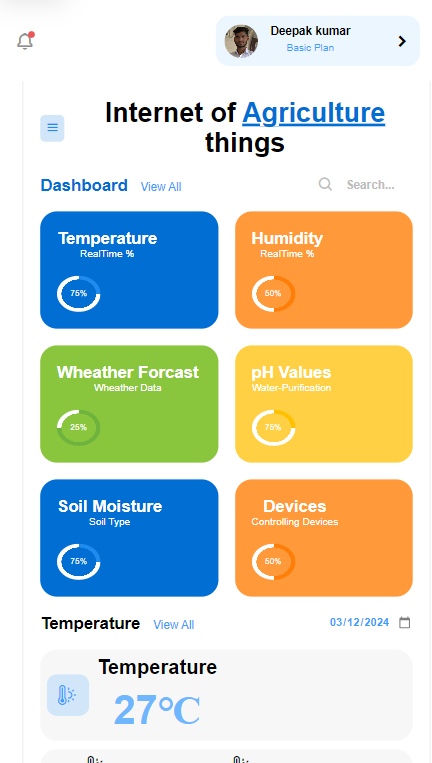

# Responsive Dashboard Design #01
In the groundbreaking project "Real-Time Agriculture Monitoring Using IoT Technology and Web Application," we have harnessed the power of the Internet of Things (IoT) to revolutionize how farmers and agriculturists manage crops and resources. By deploying sensors across fields, we collect data on soil moisture, temperature, pH levels, and more, which is then analyzed and made accessible through a user-friendly web interface. This enables farmers to make informed decisions, optimize resource use, and enhance crop yields, ensuring sustainable farming practices and a future where technology and agriculture grow hand in hand.

# Screenshot
Here we have project screenshot :

### Mobile Screenshot
